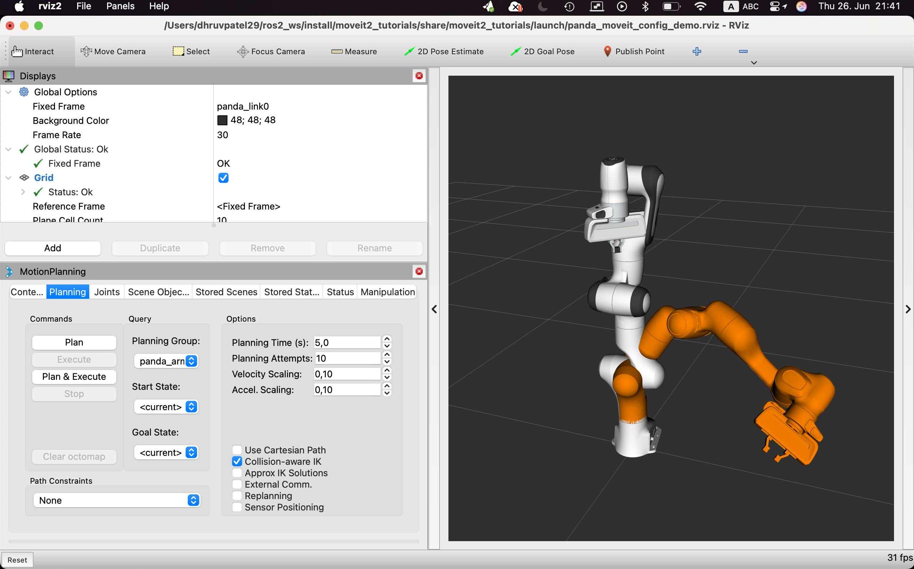

## 🤖 MoveIt 2 on macOS (Apple Silicon)

MoveIt 2 can be built on macOS (Apple Silicon) with a few extra steps.



MoveIt 2 is a powerful motion planning framework for ROS 2 that enables robot manipulation, collision checking, and kinematics.  
It provides tools and libraries to plan, execute, and visualize robot motions easily and efficiently, making it ideal for robotics research and development.

### ✅ Dependencies

```bash
brew install freeglut ompl
pip install ruckig==0.8.4
```
### 🏗️ Build Instructions

### 1. Build 
```bash
cd ~/humble-ros2
colcon build \
  --symlink-install \
  --base-paths src/moveit/  \
  --executor parallel \
  --parallel-workers $(sysctl -n hw.ncpu) \
  --cmake-args -DCMAKE_TOOLCHAIN_FILE=$MY_TOOLCHAIN_FILE
```
### 2. Test Moveit with MoveIt2_tutorials

To test that your MoveIt installation works correctly, clone the [MoveIt2 Tutorials](https://github.com/moveit/moveit2_tutorials.git) repository:

#### 1. Clone the Repo
```bash
cd ~/ros2_ws/src
git clone https://github.com/moveit/moveit2_tutorials.git -b humble
```

#### 2. Build MoveIt2 Tutorials

This build focuses on moveit2 and related packages only.

```bash
cd ~/ros2_ws
colcon build --packages-select moveit2_tutorials --symlink-install
```
```bash
source ~/.zshrc
```
#### 3. ⚠️ macOS-Specific: Preload Capability Library (temp solution)

Before running the tutorials on macOS, you must preload the MoveIt capabilities plugin manually:

```bash
export DYLD_INSERT_LIBRARIES=$HOME/humble-ros2/install/moveit_ros_move_group/lib/libmoveit_move_group_default_capabilities.dylib
```
> **Update:** This manual preload should no longer be required if you are using the latest update of this fork which will be done automatically when you clone my repo :). The `move_group` binary has been updated to explicitly link these libraries, resolving the RPath issue natively. I am keeping this instruction here as a fallback just in case.
> 
> **Technical Details:** See [MoveIt 2 Issue #3688](https://github.com/moveit/moveit2/issues/3688).
>⚠️ Note:
>On macOS, use: DYLD_INSERT_LIBRARIES,
>On Linux, use: LD_PRELOAD

#### 4. Launch MoveIt Tutorials
```bash
ros2 launch moveit2_tutorials demo.launch.py
```

